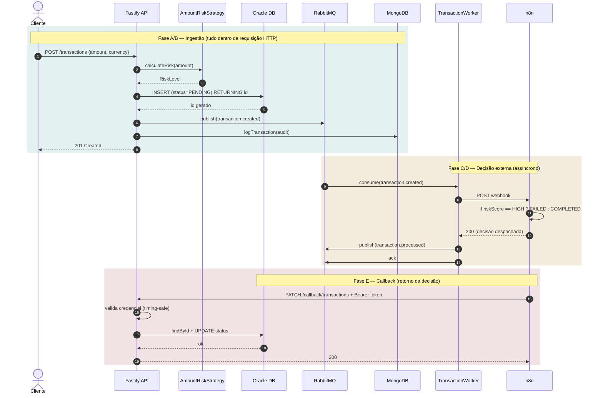
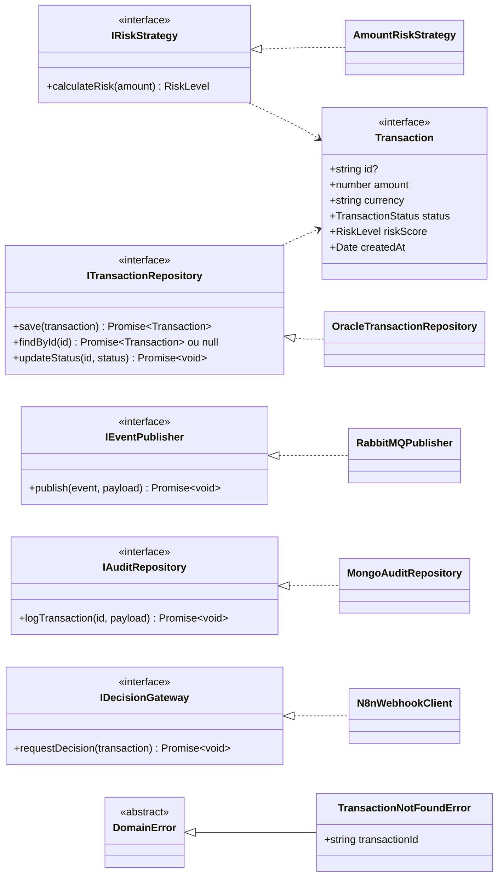
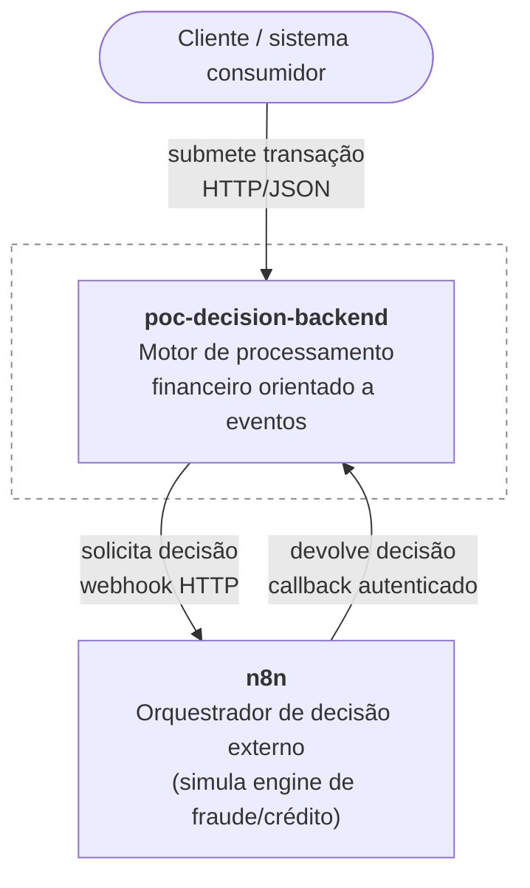
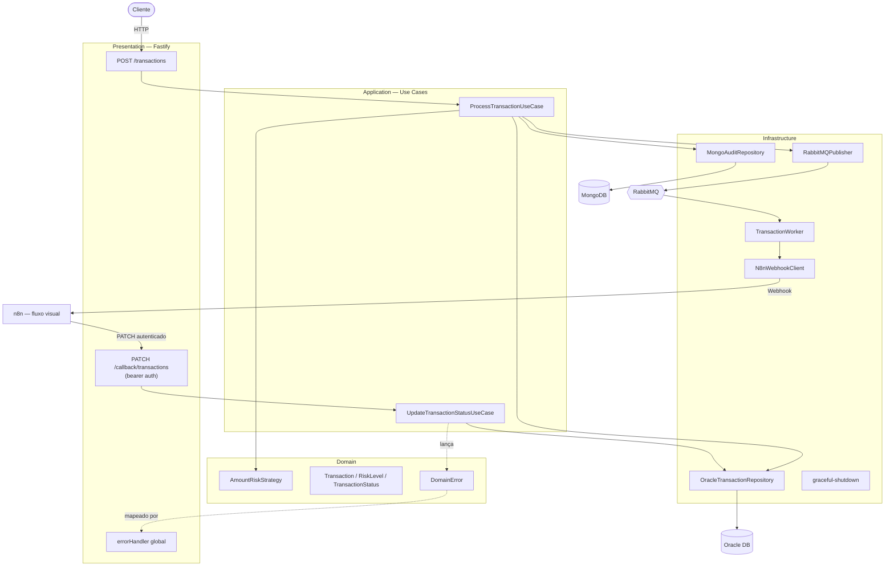
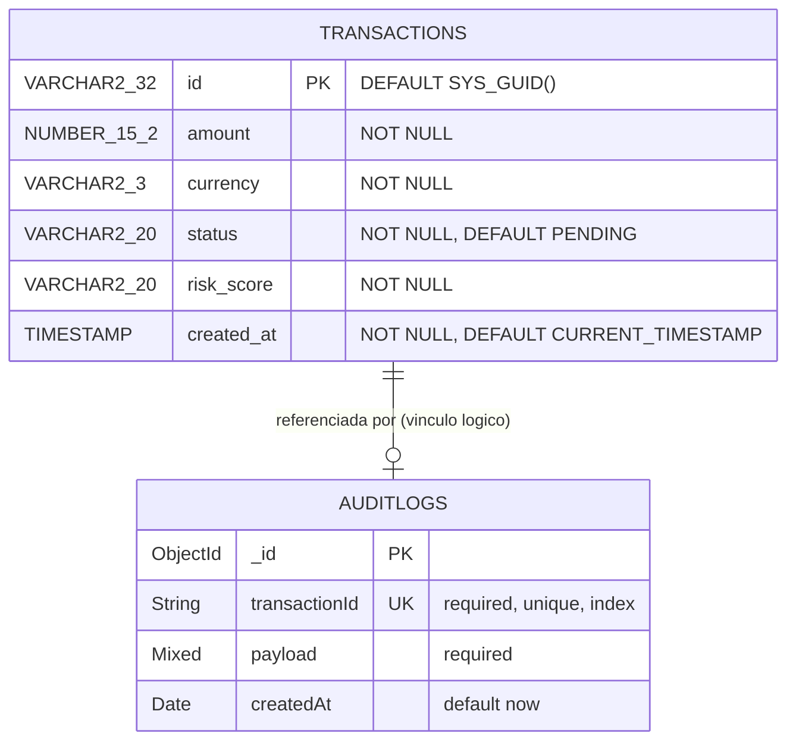

# Diagramas de Arquitetura

Diagramas do sistema como ele está implementado hoje, derivados de
[`SPECIFICATION.md`](SPECIFICATION.md).

> **Sobre status de implementação:** este documento descreve *arquitetura*, não progresso.
> O que já está pronto vs. planejado é rastreado exclusivamente em [`ROADMAP.md`](ROADMAP.md) —
> uma versão anterior deste arquivo duplicava esse status em cada seção e envelheceu mal.
> Débitos técnicos conhecidos ficam na seção "Gaps Conhecidos" do roadmap.

## 1. Arquitetura de Eventos

Ciclo de vida completo de uma transação (Fases A–E da `SPECIFICATION.md`).

Dois pontos de ordenação que são deliberados, não acidentais:

- **O `INSERT` no Oracle vem antes** do `publish` e do audit log. Publicar primeiro criaria um
  "evento fantasma": um evento anunciando uma transação que pode nunca ter sido persistida.
- **O worker chama o n8n antes** de republicar `transaction.processed`. O inverso anunciaria o
  processamento como concluído mesmo quando a decisão externa falhou.

E um ponto que **contradiz o RNF03** e está registrado como gap no roadmap: `publish` e
`logTransaction` estão dentro da requisição HTTP com `await` direto, então uma falha no RabbitMQ
ou no Mongo devolve `500` ao cliente mesmo com a transação já gravada no Oracle. O
*fire-and-forget* real ainda não existe nessa borda.

## 2. Contratos de Domínio e Implementações

O domínio define *ports* (interfaces); a infraestrutura fornece os *adapters*. Nenhuma classe de
domínio ou aplicação importa driver de banco, broker ou cliente HTTP.

`Transaction.id` é opcional porque a entidade existe em dois momentos: antes de persistir (sem
ID) e depois do `RETURNING id` do Oracle (com ID). O `ProcessTransactionUseCase` valida a
presença do ID logo após o `save` e falha explicitamente se ele não vier.

`DomainError` deliberadamente **não** carrega status HTTP — o domínio não conhece o protocolo de
transporte; o mapeamento erro → status acontece na camada de apresentação.

## 3. Arquitetura do Sistema (C4)

### 3.1 Nível 1 — Contexto

Quem usa o sistema e com que sistemas externos ele conversa.

A separação importa: o cálculo de risco *preliminar* é interno e síncrono; a decisão *final* é
externa e assíncrona. É isso que permite responder ao cliente sem esperar o orquestrador.

### 3.2 Nível 2 — Contêineres

Visão das quatro camadas e da infraestrutura.

A dependência aponta sempre para dentro: `Presentation → Application → Domain`, com
`Infrastructure` implementando as interfaces do domínio. A montagem concreta (quem injeta o quê)
fica isolada no composition root em `src/presentation/container.ts`.

## 4. Modelo de Dados (DER)

A persistência é híbrida e **não** há chave estrangeira entre os dois bancos — o vínculo é lógico,
pela aplicação. Isso é deliberado: são tecnologias distintas, com propósitos distintos.

**Oracle — `transactions`** (fonte de verdade transacional, schema em
[`db/oracle/init/TRANSACTION.sql`](db/oracle/init/TRANSACTION.sql)): o `id` é gerado pelo banco
via `SYS_GUID()` e devolvido à aplicação pelo `RETURNING id INTO`. `status` e `risk_score` são
`VARCHAR2` livres no banco — as restrições de valor vivem nos enums `TransactionStatus` e
`RiskLevel` da aplicação, não em *check constraints*.

**MongoDB — `auditlogs`** (retenção de payload bruto, schema em
[`AuditLog.model.ts`](src/infrastructure/database/mongo/AuditLog.model.ts)): `payload` é
`Schema.Types.Mixed`, ou seja, guarda o documento como veio, sem impor forma — é o que se espera
de um *data lake* de compliance.

Dois pontos que valem atenção nesse modelo:

- **`transactionId` é `unique`** na coleção de auditoria, então existe no máximo **um** registro
  por transação. Hoje isso é consistente (só a criação é auditada), mas impede auditar eventos
  posteriores da mesma transação — auditar a mudança de status vinda do callback, por exemplo,
  falharia por chave duplicada. Se a auditoria evoluir para trilha de eventos, a unicidade precisa
  sair ou virar composta com o tipo de evento.
- **Sem *check constraint* em `status`/`risk_score`**: um `UPDATE` fora da aplicação pode gravar
  qualquer texto. A validação por enum acontece na borda HTTP (JSON Schema) e no TypeScript.

---

*Diagramas mantidos manualmente — se um deles divergir do código, o código é a fonte de verdade.*
