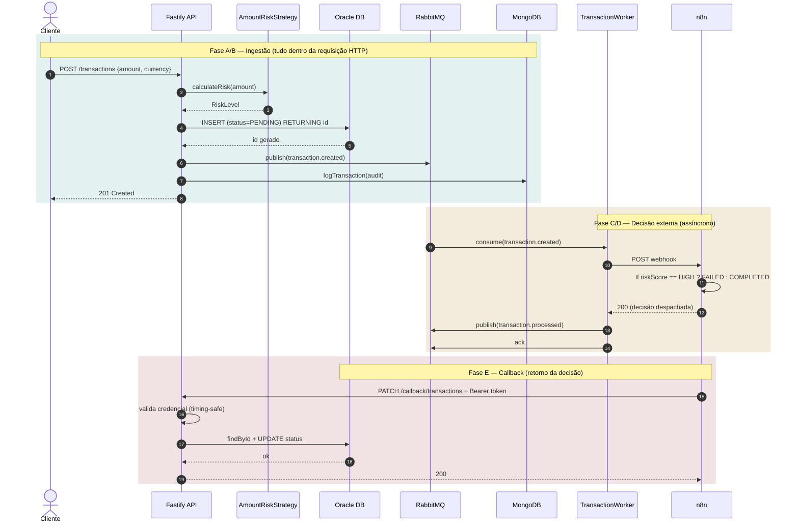
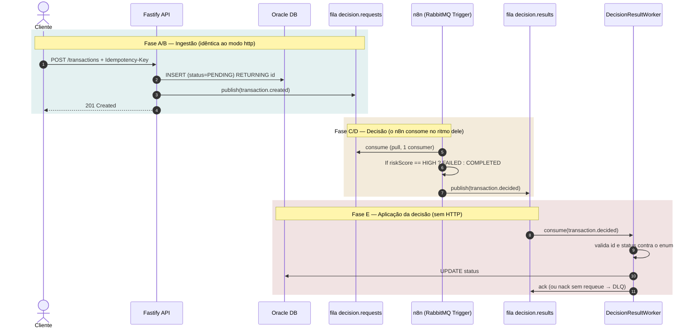
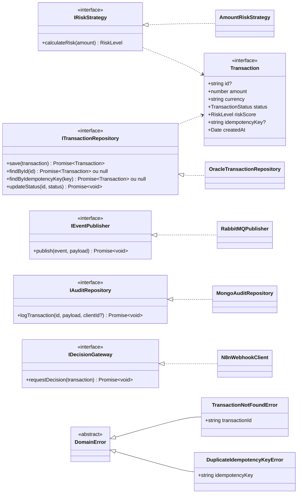
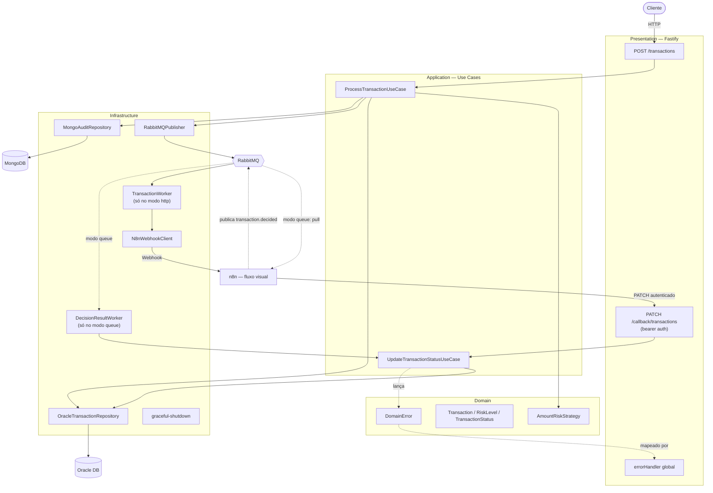
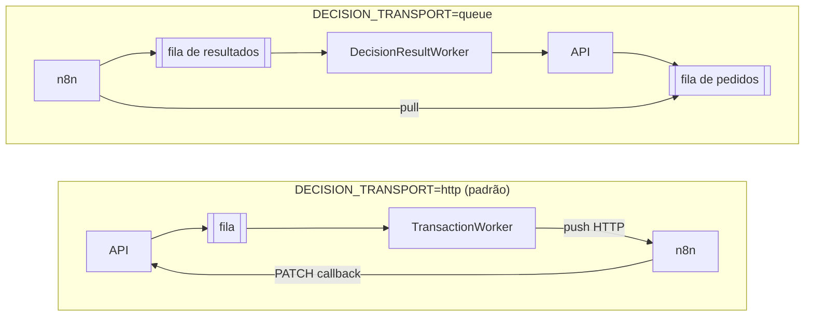
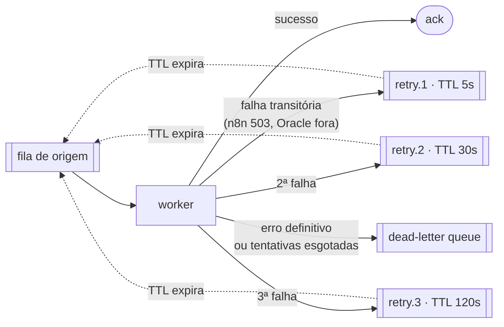
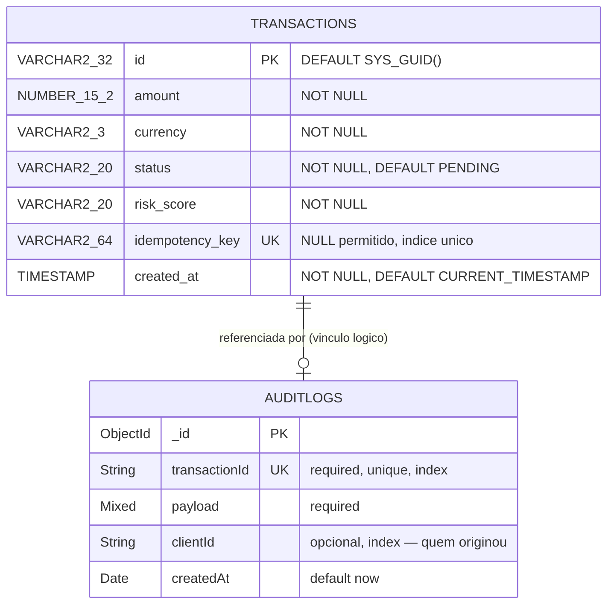

# Diagramas de Arquitetura

Diagramas do sistema como ele está implementado hoje, derivados de
[`SPECIFICATION.md`](SPECIFICATION.md).

> **Sobre status de implementação:** este documento descreve *arquitetura*, não progresso.
> O que já está pronto vs. planejado é rastreado exclusivamente em [`ROADMAP.md`](ROADMAP.md) —
> uma versão anterior deste arquivo duplicava esse status em cada seção e envelheceu mal.

## 1. Arquitetura de Eventos

O ciclo de vida de uma transação tem duas metades. A **ingestão** (Fases A/B) é sempre a mesma.
A **decisão externa** (Fases C–E) tem dois transportes possíveis, escolhidos por
`DECISION_TRANSPORT` — comparados na seção 3.3.

### 1.1 Transporte `http` — o worker empurra a decisão

Ciclo completo com o n8n recebendo por webhook e devolvendo por callback HTTP.

Dois pontos de ordenação que são deliberados, não acidentais:

- **O `INSERT` no Oracle vem antes** do `publish` e do audit log. Publicar primeiro criaria um
  "evento fantasma": um evento anunciando uma transação que pode nunca ter sido persistida.
- **O worker chama o n8n antes** de republicar `transaction.processed`. O inverso anunciaria o
  processamento como concluído mesmo quando a decisão externa falhou.

`publish` e `logTransaction` rodam sob `Promise.allSettled`: quando eles executam, o Oracle já
confirmou a escrita, então uma falha de RabbitMQ ou Mongo é registrada com severidade alta mas
**não** vira `500` — o cliente recebe `201` porque a transação de fato existe. O custo assumido é
que uma falha de `publish` deixa a transação `PENDING` sem ninguém decidir — mitigado pelo retry
com *backoff* da seção 3.4, mas não eliminado: se o `publish` inicial falhar, nem a fila de retry
entra em cena, porque a mensagem nunca chegou ao broker.

### 1.2 Transporte `queue` — o n8n puxa da fila

Aqui a fila media os **dois** sentidos. A ingestão (Fase A/B) é idêntica; o que muda é tudo
depois dela: não existe webhook, não existe rota de callback no caminho, e o `TransactionWorker`
sequer é iniciado.

A inversão de controle é o ponto todo: no modo `http` **nós** decidimos quando o n8n trabalha; no
modo `queue` **ele** decide, puxando quando tem capacidade. A fila absorve a diferença.

Duas consequências que não são cosméticas:

- **A validação de contrato muda de lugar.** No modo `http` o JSON Schema do Fastify rejeita um
  `status` fora do enum antes de qualquer código nosso rodar. Na fila não existe schema — por isso
  o `DecisionResultWorker` revalida `id` e `status` na mão e faz `nack` sem requeue no que não
  passar, mandando a mensagem para a *dead-letter queue* em vez de gravar lixo no Oracle.
- **A autenticação muda de natureza.** Some o *bearer token* das duas pontas e entra a credencial
  do broker. Quem publica em `transaction.decided` consegue alterar status — o controle de acesso
  passa a ser do RabbitMQ (usuário/vhost/permissão por exchange), não da nossa aplicação.

## 2. Contratos de Domínio e Implementações

O domínio define *ports* (interfaces); a infraestrutura fornece os *adapters*. Nenhuma classe de
domínio ou aplicação importa driver de banco, broker ou cliente HTTP.

`Transaction.id` é opcional porque a entidade existe em dois momentos: antes de persistir (sem
ID) e depois do `RETURNING id` do Oracle (com ID). O `ProcessTransactionUseCase` valida a
presença do ID logo após o `save` e falha explicitamente se ele não vier.

`DomainError` deliberadamente **não** carrega status HTTP — o domínio não conhece o protocolo de
transporte; o mapeamento erro → status acontece na camada de apresentação. `DuplicateIdempotencyKeyError`
existe justamente para manter essa fronteira: o `OracleTransactionRepository` traduz o `ORA-00001`
do driver nele, para que a camada de aplicação trate uma **corrida de idempotência** em vez de
conhecer códigos de erro do Oracle.

`IDecisionGateway` só tem implementação no modo `http`. No modo `queue` não existe adaptador de
saída para o n8n: a "chamada" ao orquestrador vira uma publicação na exchange, feita pelo mesmo
`IEventPublisher` que já publicava `transaction.created`. Um transporte a menos para manter.

## 3. Arquitetura do Sistema (C4)

### 3.1 Nível 1 — Contexto

Quem usa o sistema e com que sistemas externos ele conversa.

A separação importa: o cálculo de risco *preliminar* é interno e síncrono; a decisão *final* é
externa e assíncrona. É isso que permite responder ao cliente sem esperar o orquestrador.

### 3.2 Nível 2 — Contêineres

Visão das quatro camadas e da infraestrutura.

A dependência aponta sempre para dentro: `Presentation → Application → Domain`, com
`Infrastructure` implementando as interfaces do domínio. A montagem concreta (quem injeta o quê)
fica isolada no composition root em `src/presentation/container.ts`.

As linhas pontilhadas são o caminho alternativo do modo `queue`. Note que **os dois caminhos
convergem no mesmo `UpdateTransactionStatusUseCase`**: trocar o transporte não duplicou regra de
negócio nenhuma. É por isso que o composition root expõe
`buildUpdateTransactionStatusUseCase(pool)` — o `CallbackController` e o `DecisionResultWorker`
montam o mesmo caso de uso pelo mesmo caminho, cada um só traz o seu próprio adaptador de entrada.

### 3.3 Dois transportes para a decisão externa

A decisão do n8n pode trafegar por dois caminhos, alternados por `DECISION_TRANSPORT`.
A diferença que importa não é de tecnologia — é **quem controla o ritmo**.

| | `http` | `queue` |
| --- | --- | --- |
| Quem dita o ritmo | nosso worker **empurra** | o n8n **puxa** |
| Backpressure | inexistente — satura o n8n (6.552 `503` medidos) | natural: a fila segura o excedente |
| Pico de carga | mensagem descartada vai para a DLQ | trabalho fica enfileirado, aguardando |
| Validação do retorno | JSON Schema do Fastify na rota | manual, no `DecisionResultWorker` |
| Autenticação | bearer token nas duas pontas | credencial do broker |
| Acoplamento | n8n só precisa falar HTTP | n8n precisa de acesso ao broker |
| Componentes ativos | `TransactionWorker` + `N8nWebhookClient` + rota de callback | `DecisionResultWorker` |

### Topologia das filas

Uma única exchange `amq.topic` (durável) e três filas, todas com
`x-dead-letter-exchange` apontando para `transactions.queue.dlx`:

| Fila | Routing key | Consumidor | Ligada no modo |
| --- | --- | --- | --- |
| `transactions.queue` | `transaction.created` | `TransactionWorker` | `http` |
| `transactions.queue.decision.requests` | `transaction.created` | n8n, via *RabbitMQ Trigger* | `queue` |
| `transactions.queue.decision.results` | `transaction.decided` | `DecisionResultWorker` | `queue` |
| `transactions.queue.dead` | — (fanout da DLX) | nenhum — inspeção manual | ambos |

Como as filas se ligam por *routing key* e não por destinatário, o `RabbitMQPublisher` **não sabe
qual transporte está ativo** — ele publica `transaction.created` do mesmo jeito nos dois modos, e
quem muda é só quem está escutando. Trocar de transporte não tocou uma linha do publisher nem do
caso de uso.

**O vínculo é condicional ao transporte ativo.** As três filas são declaradas sempre (duráveis,
com a mesma DLX), mas o bootstrap liga à exchange só a fila que o modo atual consome e desliga a
do outro. Deixar as duas ligadas parece inofensivo — "a fila sem consumidor só acumula" —, mas o
`TransactionWorker` pede decisão ao n8n para **toda** mensagem que consome: ao voltar para `http`,
ele drenaria o acúmulo pedindo decisão de novo para transação já decidida, sobrescrevendo status
final. O `unbindQueue` é no-op quando o vínculo não existe, então o bootstrap continua idempotente.

### Qual usar

No código, a ausência da variável resolve para `http` — é o comportamento conservador, e é o que
se usa quando o orquestrador é **externo/SaaS**: não se entrega credencial de broker a terceiro,
e HTTP é o denominador comum que qualquer SaaS fala.

O `.env.example`, porém, já vem com `DECISION_TRANSPORT=queue`, porque nesta PoC o n8n é
**interno** (roda no mesmo `docker-compose`) — e nesse cenário o modo `queue` elimina de raiz a
saturação que o teste de carga mediu. Ou seja: o padrão do *código* é o seguro, o padrão do
*ambiente local* é o correto para esta topologia.

**Trocar de transporte exige reiniciar a aplicação**, já que a topologia é declarada no bootstrap.
A troca em si não perde mensagem: as filas continuam duráveis nos dois modos, só o vínculo com a
exchange muda. O que **não** é reversível sozinho é um acúmulo anterior — uma fila que ficou com
mensagens de antes do vínculo condicional precisa ser esvaziada uma vez
(`rabbitmqctl purge_queue`), senão o worker do modo de destino drena histórico já decidido.

### 3.4 Retry com backoff antes do descarte

Uma falha não vira descarte na primeira tentativa. Entre o worker e a fila morta existem filas de
espera — uma por nível de atraso — onde a mensagem fica parada até o broker devolvê-la sozinha.

Quatro decisões que sustentam esse desenho:

- **Quem agenda é o RabbitMQ, não a aplicação.** A fila de espera não tem consumidor: a mensagem
  vence por `x-message-ttl` e o broker a encaminha adiante. Um `setTimeout` no processo evaporaria
  junto com ele numa queda; a mensagem na fila sobrevive.
- **Uma fila por nível, não uma fila só com TTL por mensagem.** A expiração é avaliada na cabeça da
  fila, então uma mensagem de 120s na frente seguraria as de 5s atrás dela.
- **O retorno é pela exchange padrão** (`''`) com routing key igual ao nome da fila de origem — e
  **não** pela `amq.topic`. Voltar pela topic reentregaria a mensagem a toda fila ligada àquela
  routing key, não só à que falhou.
- **Nem toda falha merece nova tentativa.** JSON malformado, contrato violado e transação
  inexistente são `NonRetryableError` e vão direto para a fila morta: repetir gastaria o orçamento
  para chegar no mesmo lugar. Só falha de infraestrutura é reagendada.

O custo assumido é *at-least-once*: o worker republica a mensagem e só então confirma a original,
então uma queda exatamente nessa janela duplica a mensagem. Duplicar é preferível a perder — e é o
mesmo motivo pelo qual a ingestão aceita `Idempotency-Key`.

## 4. Modelo de Dados (DER)

A persistência é híbrida e **não** há chave estrangeira entre os dois bancos — o vínculo é lógico,
pela aplicação. Isso é deliberado: são tecnologias distintas, com propósitos distintos.

**Oracle — `transactions`** (fonte de verdade transacional, schema em
[`db/oracle/init/TRANSACTION.sql`](db/oracle/init/TRANSACTION.sql)): o `id` é gerado pelo banco
via `SYS_GUID()` e devolvido à aplicação pelo `RETURNING id INTO`. `status` e `risk_score` são
`VARCHAR2` livres no banco — as restrições de valor vivem nos enums `TransactionStatus` e
`RiskLevel` da aplicação, não em *check constraints*.

**MongoDB — `auditlogs`** (retenção de payload bruto, schema em
[`AuditLog.model.ts`](src/infrastructure/database/mongo/AuditLog.model.ts)): `payload` é
`Schema.Types.Mixed`, ou seja, guarda o documento como veio, sem impor forma — é o que se espera
de um *data lake* de compliance.

Dois pontos que valem atenção nesse modelo:

- **`transactionId` é `unique`** na coleção de auditoria, então existe no máximo **um** registro
  por transação. Hoje isso é consistente (só a criação é auditada), mas impede auditar eventos
  posteriores da mesma transação — auditar a mudança de status vinda do callback, por exemplo,
  falharia por chave duplicada. Se a auditoria evoluir para trilha de eventos, a unicidade precisa
  sair ou virar composta com o tipo de evento.
- **Sem *check constraint* em `status`/`risk_score`**: um `UPDATE` fora da aplicação pode gravar
  qualquer texto. A validação por enum acontece na borda HTTP (JSON Schema) e no TypeScript — e,
  no modo `queue`, na revalidação manual do `DecisionResultWorker`, já que ali não existe borda
  HTTP para o schema proteger.
- **`idempotency_key` usa *índice* único, não *constraint***: no Oracle um índice único admite
  múltiplos `NULL`s, então a chave continua opcional e as linhas antigas seguem válidas. É o banco
  — não a verificação prévia na aplicação — que resolve duas requisições concorrentes com a mesma
  chave; a aplicação só recupera a vencedora depois do `ORA-00001`.
- **`clientId` é indexado e opcional**: é o campo que responde "o que este cliente submeteu?", e a
  trilha só passa a ter essa resposta quando `API_CLIENTS` define credencial por cliente. Documentos
  gravados antes disso continuam válidos sem ele — daí ser opcional em vez de obrigatório.

---

*Diagramas mantidos manualmente — se um deles divergir do código, o código é a fonte de verdade.*
