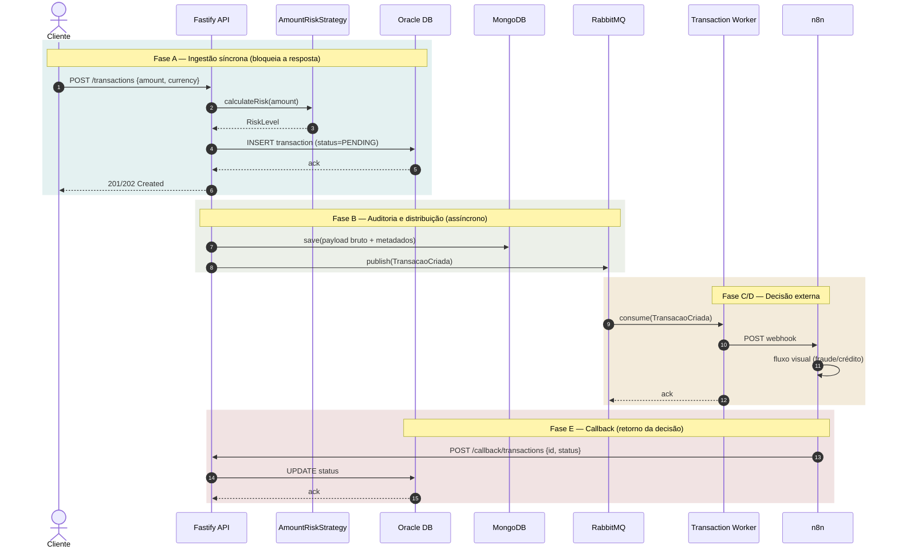
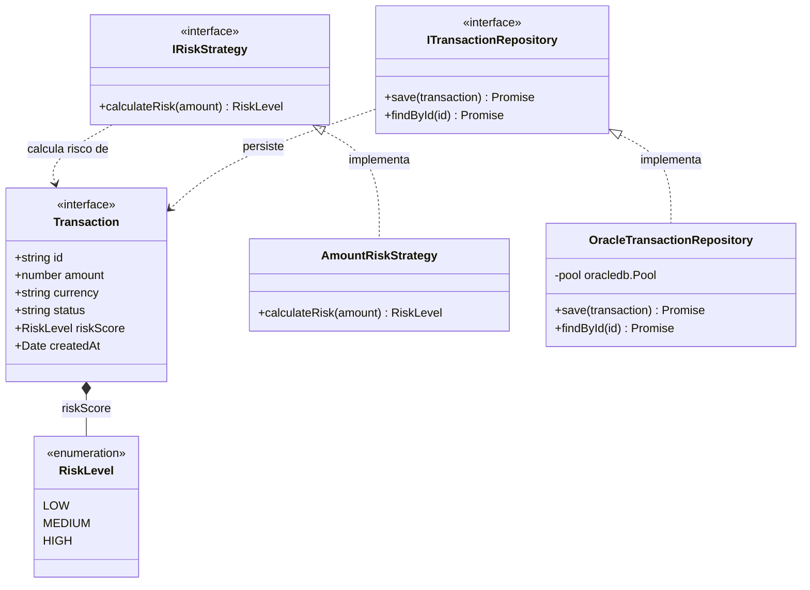
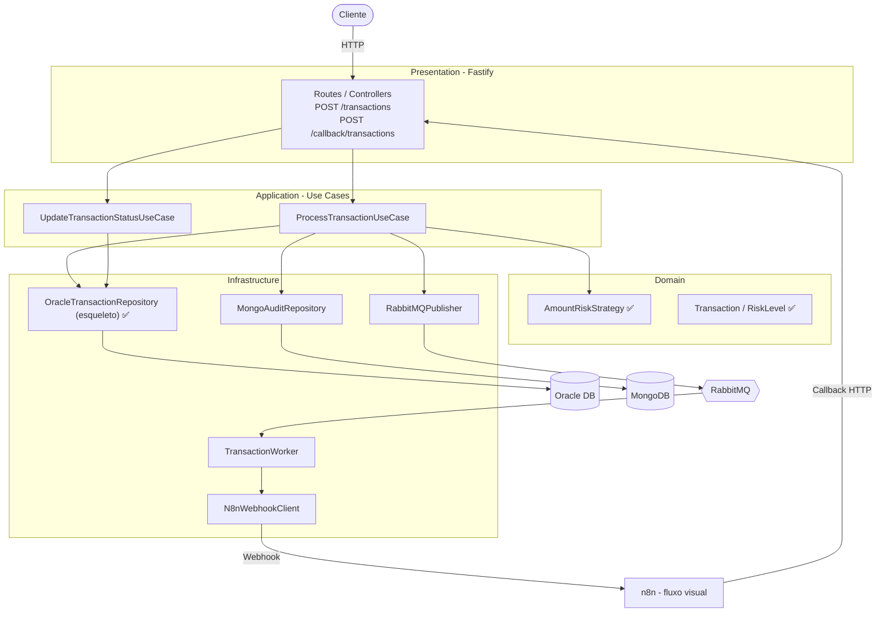

# Diagramas de Arquitetura

Rascunho para validação, gerado a partir de [`SPECIFICATION.md`](SPECIFICATION.md). O status
de cada componente (implementado vs. planejado) reflete [`ROADMAP.md`](ROADMAP.md) no momento
em que este documento foi escrito — pode ficar desatualizado; confira o roadmap para o estado atual.

## 1. Arquitetura de Eventos

A jornada completa de uma transação (Fases A–E da `SPECIFICATION.md`). O bloco "Fase A" é o
único trecho que bloqueia a resposta HTTP — tudo depois disso é *fire-and-forget* (RNF03).

**Status:** Fase A implementada em parte (`AmountRiskStrategy` completo; `OracleTransactionRepository`
é só esqueleto, sem `INSERT` real). Fases B–E ainda não têm código — publish no RabbitMQ, worker,
webhook e callback são trabalho futuro (ver `ROADMAP.md`, Fases 2–5).

## 2. Entidades e Domínio

Modelo de domínio tal como está codificado hoje em `src/domain` e
`src/infrastructure/database/oracle`. **Não** representa o schema físico do Oracle — essa
modelagem (tabelas, chaves, índices) é responsabilidade manual do engenheiro, fora do escopo de
geração por IA (ver `CLAUDE.md`).

**Status:** `Transaction`, `RiskLevel`, `IRiskStrategy` e `AmountRiskStrategy` completos e testados
(100% de cobertura). `save`/`findById` em `OracleTransactionRepository` hoje contêm apenas
`// TODO` — nenhuma query SQL foi gerada por IA, por restrição explícita do `CLAUDE.md`.

## 3. Arquitetura do Sistema

Visão de contêineres (estilo C4) das quatro camadas de Clean Architecture e da infraestrutura
externa. Componentes sem `✅` ainda não têm arquivo correspondente em `src/`.

**Status:** implementado — `AmountRiskStrategy`, `Transaction`/`RiskLevel`, esqueleto do
`OracleTransactionRepository`, e a conexão de pool do Oracle (`oracle.connection.ts`, não
representada acima por ser infraestrutura de baixo nível). Planejado — todo o resto: casos de
uso, controllers HTTP, repositório Mongo, publisher/worker do RabbitMQ e o cliente do n8n.

---

*Este documento é um rascunho gerado por IA a partir da `SPECIFICATION.md` para validação e
apresentação — revise cada diagrama e esteja pronto para explicar (e redesenhar, se preciso)
qualquer parte dele antes de usar em entrevista.*
